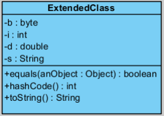

# Отчет по Учебному практическому заданию 2 
  
## Задание №1.

"Напишите программу, реализующую следующую диаграмму классов:"
  

  

"Переопределяемые методы voice() выводят соответствующую строку на консоль."

### Структура программы:  
* Интерфейс Animal
    * Задают необходимое поведение для животных (метод voice())
* Классы Cat, Dog, Cow
    * Реализуют метод voice() для нужных животных
* Класс Main
    * Тестирование
    
### Примеры работы

## Задание №2.

"Переработать задачу про игру в кости под использование интерфейсов.
Играют N игроков (компьютер в списке последний). Подкидываются
одновременно К кубиков. Выигрывает тот, у кого большая сумма очков.
Кто выиграл, тот и кидает первым в следующем кону. Игра идет до 7
выигрышей. Начинаете игру Вы."  

### Описание программы:

Переработана программа Dices из первого учебного задания. В задании неясно описано поведение различных игроков, поэтому разница между пользователем, компьютером и
остальными игроками фиктивна.

### Структура программы:  
* Класс Main
    * Обработка входных данных, вызов метода запускающего игру.
* Интерфейс Player
    * Описывающий поведение игрока в кости. Перегружен метод compareTo таким образом, чтобы игроки ходили в соответствии с местами, которые они заняли в прошлом раунде.  
* Класс DiceRoller
    * Содержит реализацию игры в кости.
* Класс BasePlayer
    * Абстрактный класс, реализующий основную логику игрока.
* Классы UserPlayer, BasePlayer, AnotherPlayer
    * Перегружают метод makeTurn.

### Примеры работы

## Задание №3.

"Напишите программу, реализующую изображенный класс:"  
  

## Задание №4.

"Создайте интерфейс Dice с методами roll() и look(). Реализуйте
интерфейс в классе DiceImpl. Метод roll() генерирует случайное
число от 1 до 6, метод look() отображает последнее
сгенерированное число в консоли."  

### Структура программы:  
* Интерфейс Dice
    * Объявление методов roll(), look()
* Класс DiceImpl
    * Реализация методов roll(), look()
* Класс Main
    * Содержит вызов методов roll() и look()

